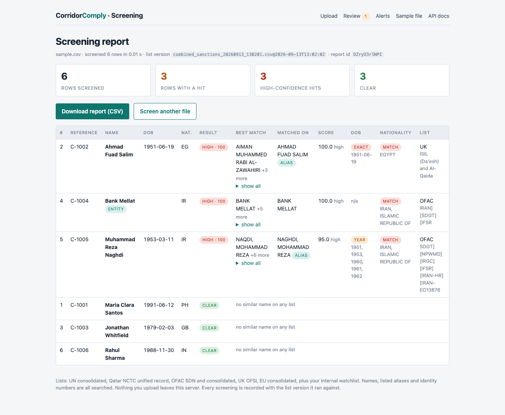
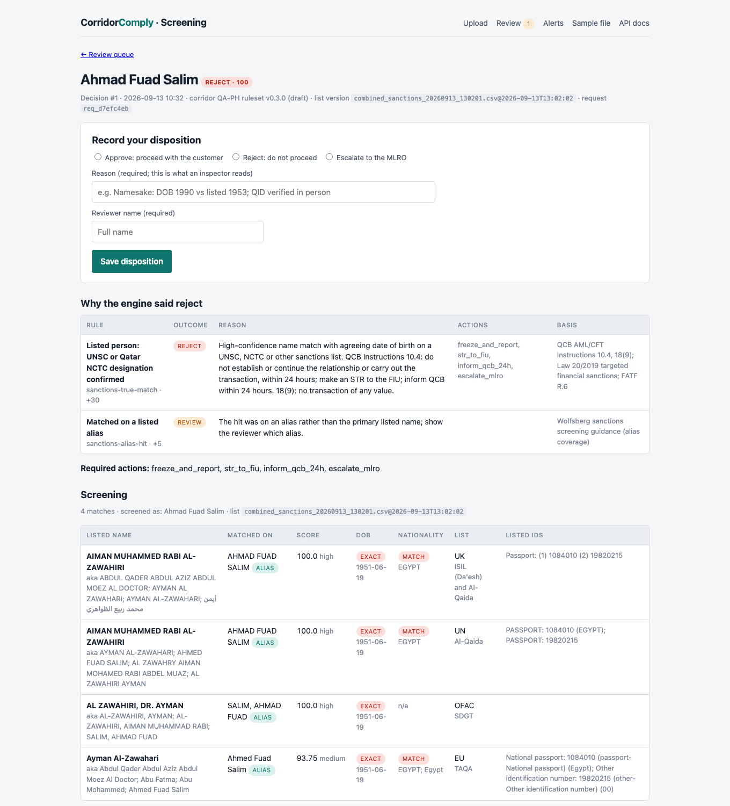
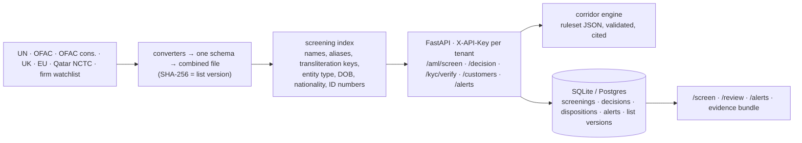

# CorridorComply

**Sanctions screening and corridor-specific KYC/AML decisions for remittance flows from the Gulf to South and Southeast Asia.**

[](https://github.com/Zezoo123/CorridorComply/actions/workflows/ci.yml)


Exchange houses, remittance fintechs and the obligated businesses around them (real estate brokers, gold dealers, auditors) must screen every customer and every beneficiary against sanctions lists, keep evidence of it, and show an inspector what they decided and why. Incumbent tools are priced and designed for banks. CorridorComply is built for the corridor: Qatar → Philippines first, with the sending regulator's rules, the receiving side's document rules and the migrant-worker customer profile encoded as data.

It runs on the customer's own machine. Nothing leaves their office.

## What it does

| Capability | Detail |
|---|---|
| **Screening** | Both the sender and the beneficiary against the UN consolidated list, Qatar's NCTC unified record (domestic designations with QID and passport numbers), OFAC SDN and non-SDN consolidated, UK OFSI, EU, and the firm's own watchlist. Names **and aliases**, transliteration variants (Mohammed / Muhammad / Mohamed), entity type, date of birth and nationality agreement, exact identity-number matching. About 1.5 ms per screen. |
| **Corridor decisions** | `POST /api/v1/decision` applies a JSON ruleset (validated by schema, signed by a named reviewer before it leaves `draft`) and returns approve / review / reject with every rule that fired and its regulatory basis. The Qatar → Philippines ruleset cites the QCB AML/CFT Instructions by item (10.4, 15.2, 18(9), 18(10), 19.5), Law 20/2019, QFCRA sanctions guidance and BSP circulars. |
| **Identity checks** | A Qatar ID number encodes birth year and nationality, so both are cross-checked against what the customer stated. Pakistani CNIC, Aadhaar (Verhoeff), Bangladeshi NID, PhilSys and passport formats. Passport (TD3) and ID-card (TD1) machine-readable zones with per-field checksums; face match; liveness through a vendor interface. |
| **Evidence** | Every screening and decision stores the checksummed list version it ran against. Reviewers record a disposition with a mandatory reason and name. `GET /api/v1/customers/{ref}/evidence` returns everything on file for one customer: the inspector bundle. |
| **Ongoing monitoring** | Customers on file are re-screened after every list update; new hits, new matching entries and cleared hits raise alerts, with a webhook. |
| **Country risk** | FATF call-for-action and increased-monitoring lists and the EU high-risk third-country annex as dated data, not constants. |
| **Console** | Upload a customer file and get a shadow-run report; a review queue and case page; alerts. One shared login. |

### What it deliberately does not do

No PEP or adverse-media data without a licensed feed (both offered as add-ons). No ownership analysis under OFAC's 50 percent rule. No document forgery detection. No transaction monitoring. Each limit is written into the pilot pack.

## See it



*Upload a customer file, get every row scored against the current list version, with the alias that matched and whether date of birth and nationality agree.*



*A decision on a listed sender: every rule that fired with its QCB citation, the screening matches, the identity-number checks, and the reviewer's disposition form.*

## Run it

```bash
git clone https://github.com/Zezoo123/CorridorComply && cd CorridorComply
python -m venv .venv && source .venv/bin/activate
pip install -r requirements.txt -r requirements-dev.txt   # add requirements-ml.txt for OCR and face match
python scripts/update_sanctions.py                        # UN, OFAC, UK, EU, Qatar NCTC (a few minutes)
python -m app.auth new-key acme-exchange                  # prints an API key once
uvicorn app.main:app --reload                             # http://127.0.0.1:8000/screen and /docs
```

Docker, screening-only by default (`--build-arg WITH_ML=1` adds OCR and face matching):

```bash
docker build -t corridorcomply .
docker run -d -p 8000:8000 -v $(pwd)/cc-data:/data corridorcomply
docker exec <container> python scripts/update_sanctions.py
```

One decision:

```bash
curl -s -X POST http://127.0.0.1:8000/api/v1/decision -H "X-API-Key: $KEY" -H "Content-Type: application/json" -d '{
  "corridor": "QA-PH",
  "customer": {"full_name": "Maria Clara Santos", "dob": "1991-06-12", "place_of_birth": "Cebu", "nationality": "PH",
               "document_type": "qatar_id", "document_number": "29160812345", "document_expiry": "2027-11-30",
               "mobile": "+974...", "address_qatar": "Al Wakrah", "profession": "nurse",
               "employer_sponsor": "Hamad Medical Corporation", "purpose": "family support", "reference": "CUST-1001"},
  "beneficiary": {"full_name": "Jose Santos", "country": "PH", "relationship": "father", "payout_channel": "cash",
                  "id_type": "ph_philsys", "id_number": "1234-5678-9012-3456"},
  "transfer": {"amount": 3000, "currency": "QAR", "receive_amount": 47000, "receive_currency": "PHP"}
}'
```

The response carries `outcome`, `reasons` (rule, reason, basis), `screening` and `beneficiary_screening`, the identity-number checks, `decision_id` and `list_version`.

Keep lists fresh and customers monitored:

```
0 3 * * *  python scripts/update_sanctions.py --max-age-hours 20 && python -m app.monitoring rescreen
```

## How it is built



More in [docs/architecture.md](docs/architecture.md), [docs/corridor_rules.md](docs/corridor_rules.md) (what the primary sources say and what the ruleset does with it), [docs/monitoring.md](docs/monitoring.md) and the generated [API reference](docs/api_reference.md).

## Pilot pack

[`docs/pilot/`](docs/pilot/README.md): onboarding guide, data-handling note, screening methodology in the Wolfsberg vocabulary, and a draft outsourcing clause covering QCB AML/CFT Instructions item 6.7.

## Status

Pilot MVP. Screening, decisions, evidence and monitoring are complete and tested (`pytest`: 135 tests). The Qatar → Philippines ruleset is a **draft** until a named compliance professional signs it; every decision says so. See [docs/roadmap.md](docs/roadmap.md).

## Tests

```bash
pytest              # fast suite, no ML models, no network
pytest --run-slow   # loads OCR and face-matching models, downloads real lists
```

## License

MIT for everything outside `premium/`. Corridor rule packs in `premium/corridor_rules/` are proprietary; see `premium/LICENSE`. List data is used under each publisher's terms (UN, US Treasury, UK OGL, EU, State of Qatar).
