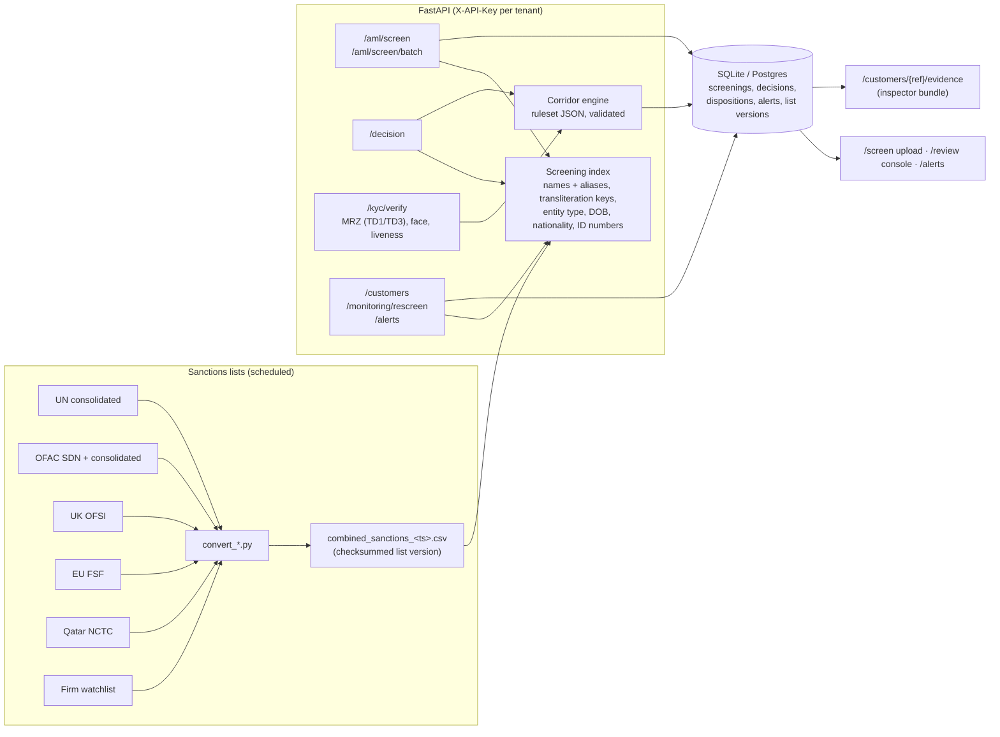

# Architecture

## Layers

- **Data pipeline** (`scripts/`): downloads each list from its publisher, converts to one schema, combines. The combined file's SHA-256 is the *list version* cited by every result. The firm's internal watchlist joins the same file.
- **Screening index** (`app/services/screening.py`): built once per list version. Blocking on normalised tokens and consonant skeletons (Mohammed / Muhammad / Mohamed share a key), RapidFuzz scoring on candidates, population-aware name variants (`app/corridor/names.py`), exact identity-number matching, DOB and nationality agreement.
- **Corridor engine** (`app/corridor/`): a ruleset is JSON validated by schema; `decide()` builds facts from the sender, beneficiary, both screenings, KYC and the transfer, fires every matching rule, and returns the most severe outcome with all reasons and their regulatory basis.
- **Persistence** (`app/db/`, `app/services/records.py`): tenants, API keys, list versions, customers, screenings, decisions with dispositions, alerts. Alembic migrations.
- **Monitoring** (`app/monitoring.py`): after each list update, re-screen customers on file; changes raise alerts, optionally to a webhook.
- **UI** (`app/routes/screen_ui.py`, Jinja2): upload and shadow-run report, review queue and case page, alerts. One shared login.

## Design choices

- **Rules are data.** A compliance professional can read and sign a JSON file; they cannot review Python. `status: draft` travels with every decision until someone signs.
- **Evidence over scores.** Every screening and decision stores the list version, the matches, the rules that fired and the reviewer's disposition. That is what an inspection reads.
- **Runs on the customer's machine.** No hosted service in the pilot; nothing leaves their premises.
- **Honest limits.** No PEP or adverse-media data without a licensed feed; no forgery detection; liveness only via a vendor; no transaction monitoring. Each is written down.
